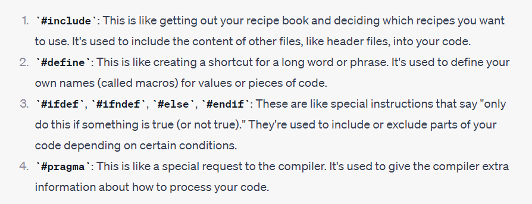
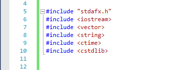

# CPP preprocessor Directives

### What is CPP preprocessor Directives?

> Imagine you're baking a cake. Before you put the cake in the oven, you might prepare the ingredients and do some setup. In C++ programming, the preprocessor is like that preparation phase before your code is actually turned into a program.

> Preprocessor directives are special commands that start with a # symbol. They tell the preprocessor what to do with your code before it's compiled (turned into a program that a computer can understand).



* We can use CPP preprocessor directives anywhere in our program.
* `#include` is a preprocessor directive that includes the contents of the `<iostream>` and other <ins>header file</ins> into your C++ program.
* when we include something at the top of the code is called "HEADER FILE".
* The `<iostream>` is C`++ Standard Library` and allows you to perform console-based input and output operations using the cin and cout streams, as well as other stream-related operations.




<br>
<br>
<br>

# HEADER FILE

* Header files should be declared at the top of your source code files.
* Including header files at the beginning of your code ensures that the declarations and definitions from those headers are available to the rest of your code that follows.

```c++
#include <iostream> // Example header file

// Other header file inclusions
#include "myheader.h"

// Function and class declarations

int main() {
    // Your program's logic

    return 0;
}

// Function and class definitions

```

<br>
<br>
<br>

# C++ Standard Library 

* The <iostream> header file is part of the <ins>C++ Standard Library.</ins>
* It provides the necessary declarations and definitions for `input` and `output` operations, such as reading from the standard input (keyboard) and writing to the standard output (console).
* This header is an <ins>essential part of C++ programming</ins>, as it allows you to work with input and output streams, such as cin (for reading input) and cout (for writing output). The << and >> operators are commonly used with these streams for formatted input and output.
* In summary, `#include <iostream>` is used to include the `input/output` stream header in your C++ program, allowing you to perform <ins>console-based input and output</ins> operations. It's a fundamental aspect of C++ programming for interacting with the user and displaying information.


<br>
<br>


#### Here are some C++ standard library

* `<vector>`: Provides the `std::vector` container, which is a dynamic array that can resize itself. It's commonly used for storing collections of elements.
* `<string>`: Provides the `std::string` class for working with <ins>strings</ins> in C++. It offers various string manipulation functions.
* `<map>` and <unordered_map>: Provide the std::map and std::unordered_map containers for associative arrays (key-value pairs).
* `<array>`: Introduces the `std::array container`, representing a <ins>fixed-size array</ins> with type safety and helpful functions.
* `<list>`: Provides the `std::list` container, which is a <ins>doubly-linked list</ins>.
* `<queue>`: Offers various queue-related data structures like std::queue and std::priority_queue.
* `<stack>`: Defines the std::stack container, representing a stack data structure.
* `<cmath>`: Provides mathematical functions like `sqrt, sin, cos`, and others. It's part of the <ins>C++ Standard Library's math functions.</ins>
* `<fstream>`: Provides <ins>classes</ins> for working with files, including input and output file streams (ifstream and ofstream), which allow reading from and writing to files.
* `<algorithm>`: Provides a collection of algorithms like `sort, find, and others` for working with collections (like arrays or vectors) <ins>efficiently</ins>.
* `<ctime>`: Provides functions and types related to date and time manipulation.
* `<cstdlib>`: Provides general-purpose functions, including memory allocation, random number generation, and other utility functions.
* `<stdexcept>`: Provides standard exception classes like `std::runtime_error`, which can be used to handle exceptional situations in your program.
* `<cstdio>`: Provides functions for working with `C-style file I/O (input/output)` operations.
* `<iomanip>`: Provides facilities for formatting input and output, including setting precision, alignment, and other formatting options.

<br>
<br>


## These are the one that I've used up untill now

* `<string>`: Provides the `std::string` class for working with <ins>strings</ins> in C++. It offers various string manipulation functions.
* `<iostrearm>`


